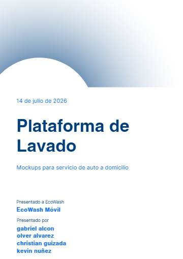
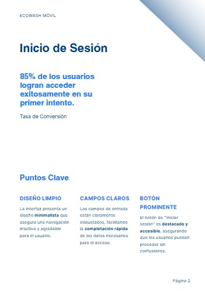
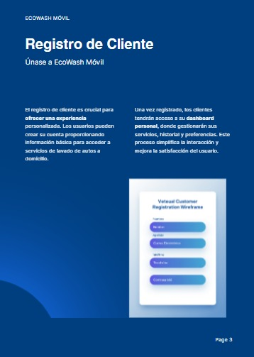
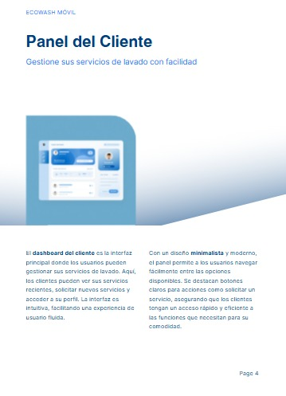
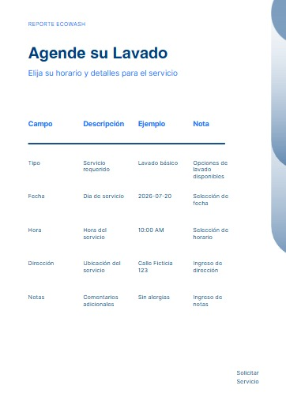

# 🚗 EcoWash Móvil

## Plataforma web para servicio de lavado de autos a domicilio

Proyecto desarrollado para la materia **Programación Web II**. El objetivo es presentar un prototipo funcional de una solución digital para gestionar reservas, usuarios y operaciones de un negocio de lavado de autos en línea.

---

## 📖 Descripción del proyecto

EcoWash Móvil es una propuesta de plataforma web orientada a facilitar la contratación de servicios de lavado de vehículos a domicilio. La idea principal es ofrecer una experiencia simple para que los clientes puedan registrarse, solicitar servicios y hacer seguimiento de sus pedidos, mientras el negocio puede organizar mejor sus operaciones.

---

## 🎯 Objetivo

Desarrollar un prototipo que permita visualizar la lógica de negocio de una plataforma de lavado de autos a domicilio, incluyendo:

- registro e inicio de sesión de usuarios
- gestión de servicios y reservas
- organización de empleados y operaciones
- simulación de procesos de pago y facturación

---

## 🛠 Tecnologías utilizadas

- HTML5
- CSS3
- Bootstrap 5
- JavaScript
- PHP
- CakePHP 5
- MySQL
- Draw.io
- dbdiagram.io
- Git
- GitHub

---

## 👥 Actores del sistema

- Cliente
- Empleado
- Administrador

---

## ✨ Funcionalidades contempladas

- Registro de usuarios
- Inicio de sesión
- Gestión de vehículos
- Solicitud de servicios
- Reservas
- Pagos
- Facturación
- Gestión de empleados
- Inventario
- Reportes
- Calificaciones
- Notificaciones

---

## 🖼 Wireframes y mockups

A continuación se muestran los bocetos visuales del prototipo:

### Integrantes del equipo

### 1. Inicio de sesión

Pantalla principal para el acceso de clientes, empleados y administradores.

### 2. Registro de cliente

Formulario para crear una nueva cuenta en la plataforma.

---
## 3. Dashboard del Cliente

Panel principal donde el cliente administra sus reservas y vehículos.

---

## 4. Solicitar Servicio

Pantalla para reservar un lavado de vehículo.

---
## 📁 Estructura del repositorio

- [README.md](README.md): descripción general del proyecto
- [wireframes/](wireframes/): archivos visuales del prototipo

---

## 🔗 Enlace del repositorio

- GitHub: https://github.com/gaboale345/prototipo
