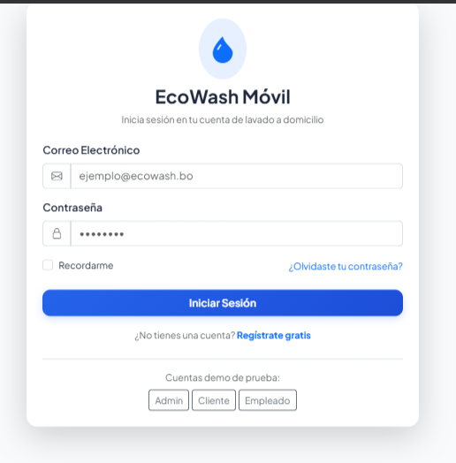
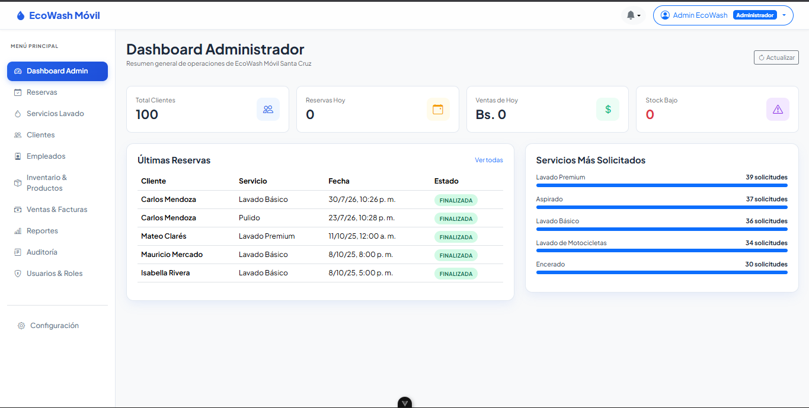
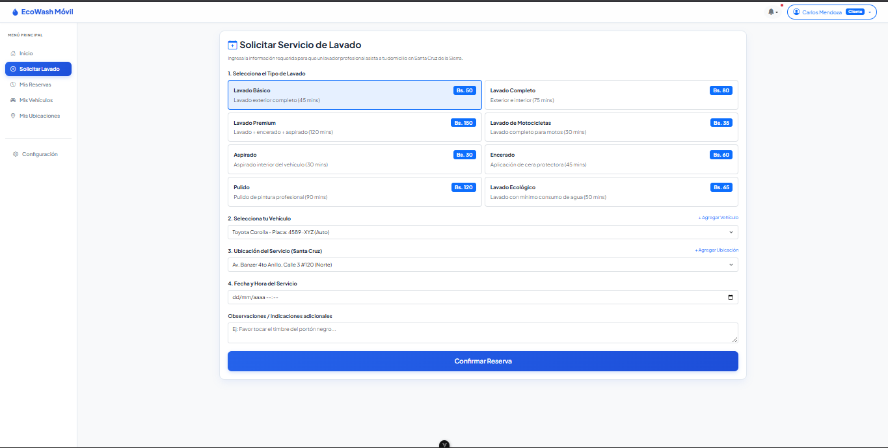
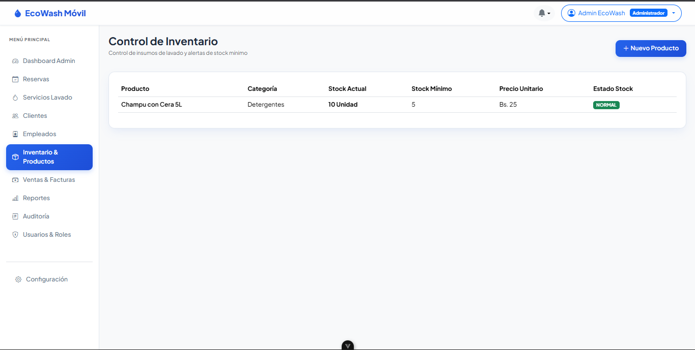
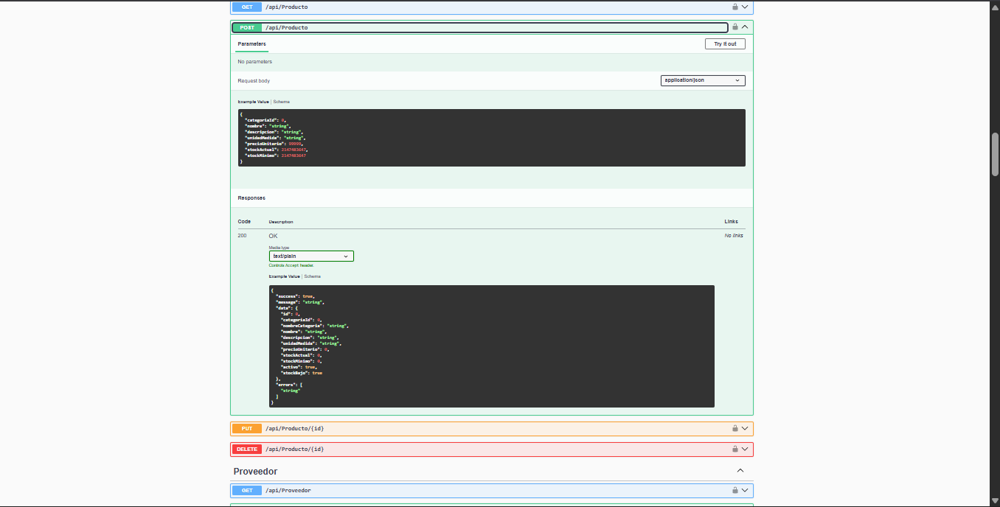

# 🚗 EcoWash Móvil — Plataforma de Gestión Comercial de Lavado de Autos a Domicilio

**Proyecto Universitario de Ingeniería de Software / Programación Web II**  
**Universidad Privada Domingo Savio (UPDS) — Santa Cruz de la Sierra, Bolivia**

---

## 📋 Descripción del Proyecto

**EcoWash Móvil** es una solución tecnológica integral y escalable diseñada para resolver la problemática de los emprendimientos de lavado de vehículos a domicilio en Santa Cruz de la Sierra. La plataforma reemplaza los registros manuales y llamadas telefónicas por un flujo automatizado que abarca desde la reserva inteligente del cliente hasta la facturación, descuento de inventario, auditoría y reportes estadísticos.

---

## ⚙️ ¿Cómo Funciona el Sistema?

EcoWash Móvil opera bajo un flujo de trabajo de **3 capas desacopladas** que se comunican mediante una API REST con autenticación JWT. A continuación se describe el ciclo completo de operación:

### 🔄 Flujo Principal de Operación

```
1. El CLIENTE accede a http://localhost:5173 → se autentica con email/contraseña
2. El sistema valida credenciales y emite un Token JWT (válido 7 días)
3. El CLIENTE registra sus vehículos y ubicaciones de domicilio
4. El CLIENTE solicita una reserva: elige vehículo, servicio, ubicación y horario
5. El ADMINISTRADOR revisa y asigna la reserva a un EMPLEADO disponible
6. El EMPLEADO recibe la reserva en su panel → la acepta → inicia el servicio → la finaliza
7. Al finalizar, el sistema genera automáticamente:
   ├── La VENTA con monto total
   ├── La FACTURA
   └── Descuenta los INSUMOS del inventario
8. El CLIENTE paga mediante QR, efectivo o tarjeta
9. El ADMINISTRADOR consulta REPORTES y AUDITORÍA del sistema
```

### 👤 Acceso por Rol

| Rol | Acciones principales |
|-----|----------------------|
| **Cliente** | Registrar vehículos, solicitar reservas, realizar pagos, ver historial, calificar |
| **Empleado** | Ver reservas asignadas, aceptar/rechazar, iniciar/finalizar servicios |
| **Administrador** | CRUD completo, gestión de inventario, reportes, auditoría, asignación de empleados |

### 🖥️ URLs de Acceso

| Servicio | URL (Local) | URL (Docker) |
|----------|-------------|--------------|
| **Frontend Vue 3** | `http://localhost:5173` | `http://localhost:80` |
| **Backend API** | `http://localhost:5275` | `http://localhost:5275` |
| **Swagger (Docs API)** | `http://localhost:5275/swagger` | `http://localhost:5275/swagger` |
| **Base de Datos** | SQLite (archivo local) | MySQL `:3306` |

### 🔐 Seguridad y Autenticación

- Todos los endpoints (excepto `/api/auth/login` y `/api/auth/register`) requieren un **Token JWT Bearer** en el header `Authorization`.
- El token se genera al iniciar sesión y se almacena en `localStorage` del navegador.
- El interceptor de Axios adjunta automáticamente el token en cada petición.
- Las contraseñas se almacenan con hash **BCrypt** (no en texto plano).

### 📦 Inicio Rápido

```bash
# Opción A — Con Docker (recomendado, un solo comando)
docker compose up -d

# Opción B — Manual
# Terminal 1: Backend
cd BackendApi && dotnet run

# Terminal 2: Frontend
cd Frontend && npm install --legacy-peer-deps && npm run dev
```

---

## 🏛️ Arquitectura del Sistema (MVC + REST API)

El proyecto sigue una **Arquitectura Desacoplada de Capas** basada en el patrón MVC:

```
 ┌─────────────────────────────────────────────────────────┐
 │               Frontend (Vue 3 + Vite)                   │
 │   VISTA - Views & Components (Bootstrap 5 + Custom)     │
 │   - State Management (Pinia Store)                      │
 │   - HTTP Client (Axios + JWT Interceptors)              │
 └────────────────────────────┬────────────────────────────┘
                              │ HTTP REST / JSON (Axios)
 ┌────────────────────────────▼────────────────────────────┐
 │        CONTROLADOR - Backend API (C# ASP.NET Core 8)    │
 │   - 20 API Controllers (GET, POST, PUT, DELETE)         │
 │   - Services & Helpers (JWT, BCrypt, Auditoría)         │
 │   - DTOs con DataAnnotations                            │
 │   - Entity Framework Core 8 (ORM + SQLite)              │
 └────────────────────────────┬────────────────────────────┘
                              │ Entity Framework Core
 ┌────────────────────────────▼────────────────────────────┐
 │          MODELO - Base de Datos (SQLite / MySQL)         │
 │   - 27 Entidades / Tablas en 3FN                        │
 │   - Foreign Keys con Integridad Referencial             │
 └─────────────────────────────────────────────────────────┘
```

**Flujo General:**
```
Usuario → Navegador → Frontend (Vue.js) → API REST (ASP.NET Core) → Base de datos (SQLite/MySQL)
```

---

## ⚡ Tecnologías Utilizadas

| Capa | Tecnología / Herramientas |
|------|---------------------------|
| **Backend** | C# .NET 8 (ASP.NET Core Web API), Entity Framework Core 8, JWT Bearer Auth, BCrypt.Net |
| **Frontend** | Vue 3 (Composition API), Vite, Pinia, Vue Router 4, Axios, Bootstrap 5.3, Bootstrap Icons |
| **Base de Datos** | SQLite (local dev) / MySQL 8.0 (producción, cumplimiento 3FN) |
| **Documentación API** | Swagger UI / OpenAPI v1 |
| **Diseño UX/UI** | Paleta `#2563EB`, Glassmorphism, Micro-animaciones |
| **Control de Versiones** | Git + GitHub |

---

## 👥 Actores del Sistema (Casos de Uso)

### Actores
1. **Cliente:** Registra sus vehículos y múltiples ubicaciones, solicita servicios de lavado, realiza pagos, consulta su historial y califica la atención.
2. **Empleado:** Revisa reservas asignadas, acepta/rechaza servicios, inicia el lavado y marca la finalización.
3. **Administrador:** Acceso completo a todos los CRUDs, generación de reportes y auditoría del sistema.

---

## 📐 Casos de Uso

### CU-01: Iniciar Sesión

| Campo | Detalle |
|-------|---------|
| **Nombre** | Iniciar Sesión |
| **Actor Principal** | Cliente / Empleado / Administrador |
| **Descripción** | Permite al usuario autenticarse en el sistema con sus credenciales para acceder a las funcionalidades según su rol. |
| **Precondiciones** | El usuario debe estar registrado en el sistema. |
| **Flujo Principal** | 1. El usuario accede a la pantalla de Login. <br>2. Ingresa su email y contraseña. <br>3. El sistema valida las credenciales. <br>4. El sistema genera un Token JWT y redirige al Dashboard según rol. |
| **Flujo Alternativo** | 3A. Si las credenciales son incorrectas, el sistema muestra mensaje de error. |
| **Post condición** | El usuario queda autenticado con un token JWT válido por 7 días. |

---

### CU-02: Solicitar Reserva de Lavado

| Campo | Detalle |
|-------|---------|
| **Nombre** | Solicitar Reserva de Lavado |
| **Actor Principal** | Cliente |
| **Descripción** | Permite al cliente registrar una solicitud de servicio de lavado a domicilio seleccionando vehículo, servicio, ubicación y horario deseado. |
| **Precondiciones** | El cliente debe estar autenticado (RN-01). El cliente debe tener al menos un vehículo y una ubicación registrados. |
| **Flujo Principal** | 1. El cliente accede a la sección "Reservar Servicio". <br>2. Selecciona el vehículo a lavar. <br>3. Selecciona el tipo de servicio y ve el precio estimado. <br>4. Selecciona la ubicación de domicilio. <br>5. Elige fecha y hora disponible. <br>6. Confirma la reserva. <br>7. El sistema registra la reserva en estado "Pendiente" y notifica al administrador. |
| **Flujo Alternativo** | 5A. Si el horario no está disponible, el sistema informa y propone horarios alternativos. |
| **Post condición** | La reserva queda registrada en estado "Pendiente" y el cliente recibe notificación de confirmación. |

---

### CU-03: Gestionar Productos e Inventario

| Campo | Detalle |
|-------|---------|
| **Nombre** | Gestionar Productos e Inventario |
| **Actor Principal** | Administrador |
| **Descripción** | Permite al administrador registrar, actualizar y desactivar productos (insumos) del inventario del negocio de lavado. |
| **Precondiciones** | El usuario debe estar autenticado con rol Administrador. |
| **Flujo Principal** | 1. El administrador accede a la sección "Inventario". <br>2. Visualiza la lista de productos con stock actual. <br>3. Selecciona "Nuevo Producto" y completa el formulario. <br>4. El sistema valida y guarda el producto. <br>5. El inventario se actualiza automáticamente. |
| **Flujo Alternativo** | 4A. Si el stock llega al mínimo, el sistema emite una alerta de bajo inventario (RN-08). |
| **Post condición** | El producto queda registrado en el catálogo y en el inventario. |

---

### CU-04: Aceptar/Rechazar Reserva

| Campo | Detalle |
|-------|---------|
| **Nombre** | Gestionar Estado de Reserva |
| **Actor Principal** | Empleado |
| **Descripción** | Permite al empleado revisar las reservas asignadas y aceptarlas, iniciar el servicio y marcarlo como finalizado. |
| **Precondiciones** | El empleado debe estar autenticado. La reserva debe estar en estado "Asignada". |
| **Flujo Principal** | 1. El empleado accede a su Dashboard. <br>2. Visualiza las reservas asignadas. <br>3. Acepta la reserva (estado → "Aceptada"). <br>4. Al llegar al domicilio inicia el servicio (estado → "En Proceso"). <br>5. Al finalizar marca el servicio como completado (estado → "Finalizada"). <br>6. El sistema genera automáticamente la venta y descuenta insumos del inventario. |
| **Flujo Alternativo** | 3A. El empleado puede rechazar la reserva indicando el motivo. |
| **Post condición** | La venta queda generada automáticamente (RN-06) y el inventario actualizado (RN-07). |

---

### CU-05: Generar Reportes

| Campo | Detalle |
|-------|---------|
| **Nombre** | Generar Reportes Estadísticos |
| **Actor Principal** | Administrador |
| **Descripción** | Permite al administrador visualizar reportes de ventas, servicios más solicitados, empleados con mayor rendimiento e ingresos por período. |
| **Precondiciones** | El usuario debe estar autenticado con rol Administrador (RN-09). |
| **Flujo Principal** | 1. El administrador accede a "Reportes". <br>2. Selecciona el tipo de reporte y el rango de fechas. <br>3. El sistema procesa y muestra los gráficos y tablas estadísticas. <br>4. El administrador puede exportar el reporte. |
| **Post condición** | El reporte queda generado y disponible para análisis. |

---

### CU-06: Registrar Pago

| Campo | Detalle |
|-------|---------|
| **Nombre** | Registrar Pago de Servicio |
| **Actor Principal** | Cliente |
| **Descripción** | Permite al cliente realizar el pago de una reserva aceptada o finalizada mediante QR, efectivo o tarjeta. |
| **Precondiciones** | La reserva debe estar en estado "Aceptada" o posterior (RN-05). El cliente debe estar autenticado. |
| **Flujo Principal** | 1. El cliente accede a "Mis Reservas". <br>2. Selecciona la reserva a pagar. <br>3. Elige el método de pago (QR / Efectivo / Tarjeta). <br>4. Confirma el pago. <br>5. El sistema registra el pago y genera la factura. |
| **Flujo Alternativo** | 4A. Si el pago falla, el sistema informa al cliente y permite reintentar. |
| **Post condición** | El pago queda registrado, la venta marcada como "Pagada" y la factura generada automáticamente. |

---

## 🛡️ Reglas de Negocio Implementadas

- **RN-01:** Un cliente debe estar autenticado para reservar un servicio.
- **RN-02:** Un vehículo pertenece a un solo cliente (Clave foránea única).
- **RN-03:** Una reserva solo puede asignarse a un empleado activo y disponible.
- **RN-04:** No se permiten dos reservas para el mismo empleado en el mismo rango de horario.
- **RN-05:** El pago solo puede realizarse cuando la reserva está en estado Aceptada o posterior.
- **RN-06:** La venta se genera automáticamente únicamente al **finalizar** el servicio.
- **RN-07:** Cada servicio finalizado descuenta automáticamente insumos del inventario.
- **RN-08:** Cuando el stock de un producto alcanza el nivel mínimo, se emite una notificación de alerta al administrador.
- **RN-09:** Exclusividad de reportes para el rol Administrador.
- **RN-10:** Registro automático de auditoría en cada acción crítica del sistema (Login, Creación, Modificación, Eliminación).

---

## 📊 Entidades del Modelo de Datos (3FN)

### Estructura de Tablas Principales

**Cliente**
| Campo | Tipo | Descripción |
|-------|------|-------------|
| IdCliente (PK) | INT | Identificador único |
| UsuarioId (FK) | INT | Relación con Usuario |
| Ci | VARCHAR | Carnet de identidad |
| Direccion | VARCHAR | Dirección principal |
| Ciudad | VARCHAR | Ciudad |

**Venta**
| Campo | Tipo | Descripción |
|-------|------|-------------|
| IdVenta (PK) | INT | Identificador único |
| Fecha | DATETIME | Fecha de la venta |
| Total | DECIMAL | Monto total |
| ReservaId (FK) | INT | Reserva asociada |

### Relaciones
- **UNO A UNO (1:1):** Usuario ↔ Cliente / Usuario ↔ Empleado
- **UNO A MUCHOS (1:N):** Cliente → Vehículos / Cliente → Reservas / Reserva → DetalleVenta
- **MUCHOS A MUCHOS (N:M):** Productos ↔ Ventas (tabla intermedia: DetalleVenta)

### Todas las entidades (27 tablas en 3FN)

`Emprendimiento` · `Rol` · `Permiso` · `RolPermiso` · `Usuario` · `Cliente` · `Empleado` · `Categoria` · `Producto` · `Proveedor` · `Compra` · `DetalleCompra` · `Inventario` · `MovimientoInventario` · `Vehiculo` · `Ubicacion` · `Servicio` · `Reserva` · `Venta` · `DetalleVenta` · `MetodoPago` · `Pago` · `Factura` · `Calificacion` · `Notificacion` · `Auditoria` · `Reporte`

---

## 🎨 Wireframes & Mockups — Diseño de Interfaces (UX/UI)

> Diseño realizado siguiendo principios de **UI/UX**: colores corporativos `#2563EB`, responsive design, dark mode, micro-animaciones y glassmorphism.

### Pantalla 1 — Login (Inicio de Sesión)


*Formulario de autenticación con JWT. Campos: email y contraseña. Redirige al Dashboard según rol del usuario.*

---

### Pantalla 2 — Dashboard Administrador


*Panel de control con estadísticas en tiempo real: Total Clientes, Ingresos del Mes, Reservas Activas, Empleados. Gráficos de barras de ventas y tabla de reservas recientes.*

---

### Pantalla 3 — Solicitar Reserva (Cliente)


*Formulario de reserva: selección de vehículo, tipo de servicio con precio estimado, selección de ubicación, fecha y hora. Botón de confirmación.*

---

### Pantalla 4 — Gestión de Productos e Inventario (Admin)


*Tabla CRUD de productos con columnas: nombre, categoría, stock actual, stock mínimo, precio. Alertas de stock bajo en rojo. Modal de crear/editar.*

---


## 🔌 Documentación de la API REST — Evidencias Swagger

> El sistema implementa **20 controladores REST** con métodos GET, POST, PUT y DELETE. La documentación interactiva está disponible en `http://localhost:5275/swagger`.



### Controladores implementados

| Controlador | Descripción |
|-------------|-------------|
| `AuthController` | Login y registro de usuarios con JWT |
| `ClienteController` | CRUD completo de clientes |
| `ProductoController` | CRUD de productos e inventario |
| `ReservaController` | Gestión completa del ciclo de reservas |
| `ServicioController` | CRUD de tipos de servicio |
| `EmpleadoController` | CRUD de empleados |
| `VentaController` | Consulta de ventas |
| `PagoController` | Registro y consulta de pagos |
| `FacturaController` | Generación de facturas |
| `InventarioController` | Control de stock |
| `ReporteController` | Reportes estadísticos |
| `AuditoriaController` | Historial de auditoría |
| + 8 más | Calificación, Notificación, Vehículo, Ubicación, etc. |

---

### 📡 Endpoints — ClienteController

#### GET `/api/cliente` — Obtener todos los clientes
**Descripción:** Retorna la lista completa de clientes con sus vehículos, ubicaciones y estadísticas.  
**Autorización:** `Administrador`, `Empleado` (Bearer Token JWT requerido)

**Respuesta exitosa (200 OK):**
```json
{
  "success": true,
  "data": [
    {
      "id": 1,
      "nombreCompleto": "Juan Pérez López",
      "email": "juan@gmail.com",
      "telefono": "77654321",
      "ciudad": "Santa Cruz",
      "totalVehiculos": 2,
      "totalReservas": 5,
      "totalGastado": 450.00
    }
  ]
}
```

---

#### GET `/api/cliente/{id}` — Obtener cliente por ID
**Descripción:** Retorna los datos completos de un cliente específico con sus vehículos y ubicaciones.

**Respuesta exitosa (200 OK):**
```json
{
  "success": true,
  "data": {
    "id": 1,
    "nombreCompleto": "Juan Pérez López",
    "email": "juan@gmail.com",
    "ci": "8765432",
    "vehiculos": [
      { "id": 1, "placa": "5678-SCZ", "marca": "Toyota", "tipo": "Sedan" }
    ],
    "ubicaciones": [
      { "id": 1, "zona": "Plan 3000", "esPrincipal": true }
    ]
  }
}
```

---

#### PUT `/api/cliente/{id}` — Actualizar cliente
**Descripción:** Actualiza los datos del cliente. Solo el propio cliente o un Administrador puede hacerlo.

**Request Body:**
```json
{
  "ci": "9876543",
  "direccion": "Av. Radial 17 y medio",
  "ciudad": "Santa Cruz"
}
```

**Respuesta exitosa (200 OK):**
```json
{
  "success": true,
  "message": "Datos del cliente actualizados"
}
```

---

### 📡 Endpoints — ProductoController

#### GET `/api/producto` — Listar productos
**Descripción:** Retorna todos los productos activos con su stock actual y categoría.

**Respuesta exitosa (200 OK):**
```json
{
  "success": true,
  "data": [
    {
      "id": 1,
      "nombre": "Shampoo para autos",
      "nombreCategoria": "Limpieza",
      "precioUnitario": 35.00,
      "stockActual": 50,
      "stockMinimo": 10,
      "unidadMedida": "Litros"
    }
  ]
}
```

---

#### POST `/api/producto` — Crear nuevo producto
**Autorización:** Solo `Administrador`

**Request Body:**
```json
{
  "categoriaId": 1,
  "nombre": "Cera Carnauba Premium",
  "descripcion": "Cera de alta protección UV",
  "unidadMedida": "Kg",
  "precioUnitario": 120.00,
  "stockActual": 20,
  "stockMinimo": 5
}
```

**Respuesta exitosa (200 OK):**
```json
{
  "success": true,
  "message": "Producto creado exitosamente",
  "data": { "id": 15, "nombre": "Cera Carnauba Premium", ... }
}
```

---

#### PUT `/api/producto/{id}` — Actualizar producto
**Autorización:** Solo `Administrador`

**Request Body:**
```json
{
  "categoriaId": 1,
  "nombre": "Cera Carnauba Premium Pro",
  "precioUnitario": 130.00,
  "stockActual": 25,
  "stockMinimo": 5
}
```

**Respuesta exitosa (200 OK):**
```json
{
  "success": true,
  "message": "Producto actualizado correctamente"
}
```

---

#### DELETE `/api/producto/{id}` — Desactivar producto
**Autorización:** Solo `Administrador`

**Respuesta exitosa (200 OK):**
```json
{
  "success": true,
  "message": "Producto desactivado correctamente"
}
```

---

### 📡 Endpoints — AuthController

#### POST `/api/auth/login` — Inicio de Sesión
**Descripción:** Autentica al usuario y retorna el Token JWT.

**Request Body:**
```json
{
  "email": "admin@ecowash.bo",
  "password": "Admin@1234"
}
```

**Respuesta exitosa (200 OK):**
```json
{
  "success": true,
  "data": {
    "token": "eyJhbGciOiJIUzI1NiIsInR5cCI6IkpXVCJ9...",
    "rol": "Administrador",
    "nombre": "Administrador EcoWash",
    "expiresIn": "7 días"
  }
}
```

---

## 🔗 Conexión Frontend — Backend (Axios + CORS)

### Configuración CORS en ASP.NET Core

```csharp
// Program.cs
builder.Services.AddCors(options =>
{
    options.AddPolicy("AllowAll", policy =>
    {
        policy.AllowAnyOrigin()
              .AllowAnyMethod()
              .AllowAnyHeader();
    });
});
app.UseCors("AllowAll");
```

### Cliente HTTP con Axios (Frontend)

```javascript
// src/services/api.js
import axios from 'axios'

const api = axios.create({
  baseURL: 'http://localhost:5275/api', // URL de la API
  headers: { 'Content-Type': 'application/json' }
})

// Interceptor: adjunta Token JWT automáticamente
api.interceptors.request.use((config) => {
  const token = localStorage.getItem('ecowash_token')
  if (token) config.headers.Authorization = `Bearer ${token}`
  return config
})

export default api
```

### Ejemplo de uso en Vue 3 (Composition API)

```javascript
// Reactividad: los datos se actualizan automáticamente en la UI
import { ref, onMounted } from 'vue'
import api from '@/services/api'

const productos = ref([])

onMounted(async () => {
  const response = await api.get('/producto')
  productos.value = response.data.data  // Vue actualiza la lista automáticamente
})
```

```html
<!-- v-for: Renderizado de lista reactiva -->
<li v-for="producto in productos" :key="producto.id">
  {{ producto.nombre }} — Stock: {{ producto.stockActual }}
</li>
```

---

## 🐳 Fundamentos de Docker y Contenerización de Proyecto

El proyecto **EcoWash Móvil** incluye soporte completo de contenerización con **Docker** y **Docker Compose**, lo que resuelve el problema del *"En mi computadora funciona"* al garantizar entornos aislados, idénticos y reproducibles en cualquier sistema.

### ❓ El Problema del "En mi computadora funciona"
Diferencias de versión en Node.js, MySQL, .NET SDK o extensiones del SO provocan fallas al trasladar proyectos entre computadoras. Docker elimina estas diferencias encapsulando el código, runtime y dependencias dentro de contenedores reproducibles.

### 📊 Máquinas Virtuales vs. Contenedores
| Característica | Máquina Virtual | Contenedor (Docker) |
|----------------|-----------------|---------------------|
| **Sistema Operativo** | Incluye SO huésped completo | Comparte el Kernel del SO anfitrión |
| **Tiempo de inicio** | Minutos | Segundos |
| **Consumo de recursos** | Alto | Bajo y eficiente |
| **Portabilidad** | Buena | Muy buena |
| **Aislamiento** | A nivel de Hardware | A nivel de Procesos |

### 🧩 Arquitectura de 3 Contenedores del Proyecto
```
Usuario → Navegador → Contenedor Frontend (Vue 3 + Nginx :80)
                             │ Proxy /api/
                      Contenedor Backend (ASP.NET Core 8 API :5275)
                             │ SQL Connection
                      Contenedor Database (MySQL 8.0 :3306)
```

1. **Contenedor Frontend (Vue 3 + Nginx):** Servidor web Nginx que sirve la SPA compilada de Vue 3 en el puerto 80 y realiza proxy inverso hacia la API.
2. **Contenedor Backend API (ASP.NET Core 8):** Ejecuta la lógica REST API, controladores y autenticación JWT.
3. **Contenedor Base de Datos (MySQL 8.0):** Almacena las tablas relacionales y mantiene los datos persistentes mediante un **Volumen Docker** (`db_data`).

> 📖 **Documentación Teórica Completa:** Consulta la guía extendida en [`docs/DOCKER.md`](file:///c:/Users/SCPC411/Downloads/pro2.0/docs/DOCKER.md) para ver los diagramas conceptuales, Dockerfile multi-stage y despliegue en AWS EC2.

---

## ⚡ Ejecución Instantánea con Docker Compose

Si tienes **Docker Desktop** instalado, puedes iniciar todo el ecosistema (Frontend + Backend + MySQL) con un solo comando:

```bash
docker compose up -d
```

- 🌐 **Frontend (Vue 3 + Nginx):** `http://localhost:80` o `http://localhost:5173`
- ⚙️ **Backend API (ASP.NET Core):** `http://localhost:5275`
- 📖 **Swagger UI:** `http://localhost:5275/swagger`
- 🗄️ **Base de Datos MySQL:** Puerto `3306` (`user: root`, `pass: root`, `db: ecowash_db`)

Para detener los contenedores:
```bash
docker compose down
```

---

## 🚀 Guía de Instalación y Ejecución Local (Sin Docker)

### Prerrequisitos
- [.NET 8 SDK](https://dotnet.microsoft.com/download/dotnet/8.0)
- [Node.js v18+ & npm](https://nodejs.org/)
- MySQL Server 8.0+ *(opcional, el proyecto usa SQLite por defecto)*

### 1. Clonar el repositorio
```bash
git clone https://github.com/gaboale345/prototipo.git
cd prototipo
```

### 2. Iniciar el Backend API (C# .NET 8)
```bash
cd BackendApi
dotnet run
```
> ✅ El backend estará disponible en `http://localhost:5275`  
> 📖 Swagger UI en `http://localhost:5275/swagger`  
> 🗄️ La base de datos SQLite se crea **automáticamente** con datos de prueba (seed)

### 3. Iniciar el Frontend (Vue 3)
```bash
cd Frontend
npm install --legacy-peer-deps
npm run dev
```
> ✅ El frontend estará disponible en `http://localhost:5173`

---

## 🔐 Credenciales de Prueba (Seed Data)

| Rol | Email | Contraseña |
|-----|-------|------------|
| **Administrador** | `admin@ecowash.bo` | `Admin@1234` |
| **Empleado** | `empleado@ecowash.bo` | `Empleado@1234` |
| **Cliente** | `cliente@ecowash.bo` | `Cliente@1234` |

---

## 🔀 Flujo de Git — Control de Versiones

```
Working Directory  →  git add .  →  Staging Area  →  git commit -m "mensaje"
                                                              ↓
                                                       git push origin main
                                                              ↓
                                                    Repositorio Remoto (GitHub)
```

### Comandos utilizados en el proyecto

```bash
git init                                    # Inicializar repositorio
git add .                                   # Agregar cambios al staging
git status                                  # Ver estado del repositorio
git commit -m "Implementación de Login"     # Registrar cambios con descripción
git pull origin main                        # Obtener cambios remotos
git push origin main                        # Enviar cambios al repositorio
```

### Historial de commits del proyecto

| Commit | Descripción |
|--------|-------------|
| `feat: Arquitectura base del proyecto` | Estructura inicial MVC + configuración de rutas |
| `feat: Implementación de autenticación JWT` | AuthController, login y registro |
| `feat: CRUD de Clientes y Vehículos` | ClienteController, VehiculoController |
| `feat: Sistema de Reservas completo` | ReservaController con flujo de estados |
| `feat: Inventario y gestión de Productos` | ProductoController, InventarioController |
| `feat: Frontend Vue 3 - Dashboard Admin` | Vistas administrativas con Axios |
| `feat: Frontend Vue 3 - Portal Cliente` | Reservar, pagar, historial |
| `feat: Reportes y Auditoría` | ReporteController, AuditoriaController |

---

## 📄 Créditos Universitarios

- **Institución:** Universidad Privada Domingo Savio (UPDS)
- **Sede:** Santa Cruz de la Sierra, Bolivia
- **Materia:** Programación Web II
- **Año:** 2026
